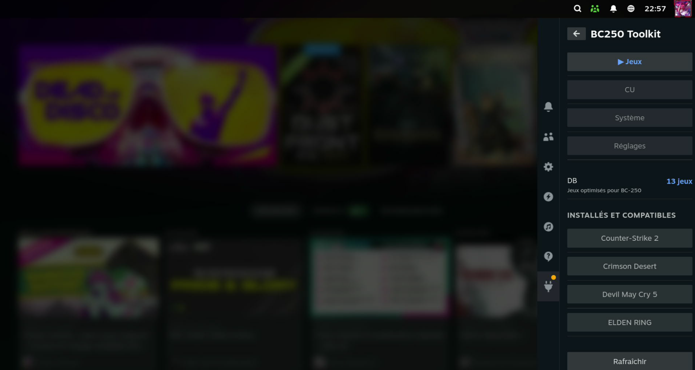
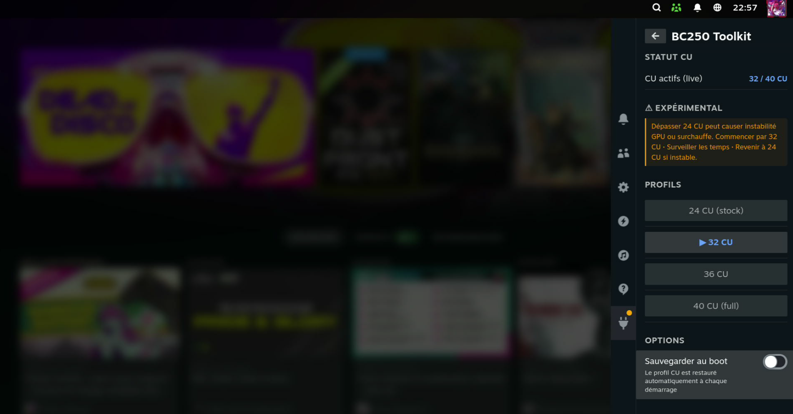
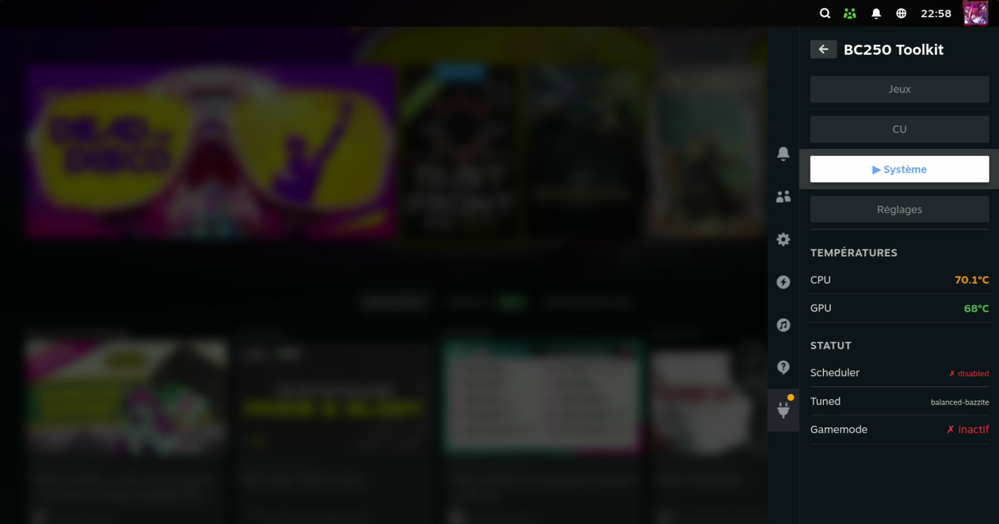
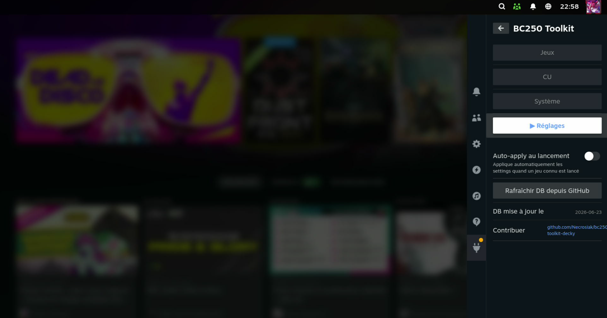
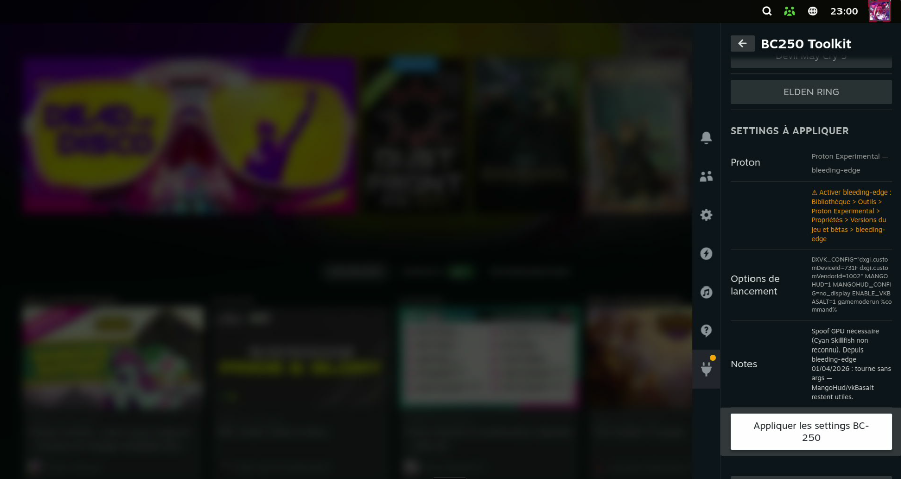

# BC250 Toolkit — DeckyLoader Plugin

> 🌐 [EN](README.md) · [FR](README.fr.md) · [DE](README.de.md) · [ES](README.es.md) · [IT](README.it.md) · [PT](README.pt.md) · [NL](README.nl.md) · [PL](README.pl.md) · [RU](README.ru.md)

A [DeckyLoader](https://github.com/SteamDeckHomebrew/decky-loader) plugin for the **ASRock BC-250** (AMD Ryzen Embedded V2000 / Cyan Skillfish) running Bazzite or SteamOS Linux.

Community database of optimized launch options for the BC-250 — apply in one click from the Steam Quick Access Menu.

---

## Screenshots

<p align="center">
  
  
  
</p>
<p align="center">
  
  
</p>

---

## Features

### Games Tab
- Automatically detects the selected game in the Steam library
- Displays recommended settings for the BC-250 (Proton version, launch options, notes)
- **Apply button** — writes launch options and selects Proton directly via backend
- **Auto-apply** (opt-in) — automatically applies settings when a known game is launched

### CU (Compute Units) Tab
- Live readout of active CU count via GPU SPI registers
- 4 profiles:
  - **24 CU** (stock BC-250)
  - **32 CU**
  - **36 CU**
  - **40 CU** (full — all WGPs active)
- Live application without reboot
- **Save to boot** toggle — installs a systemd service that restores the profile at each startup
- Requires `umr` — **automatic installation via a button** (`rpm-ostree install --apply-live`, no reboot needed)
- Built-in disclaimer and stability recommendations

### System Tab
- Real-time CPU/GPU temperatures
- scx_lavd status, tuned profile, gamemode daemon status
- Manual update button for [bc250-tweaks](https://github.com/Necrosiak/bc250-tweaks)

### Settings Tab
- Auto-apply toggle
- DB refresh from GitHub

---

## Interface language

The plugin automatically detects the Steam interface language:

**English · Français · Deutsch · Español · Italiano · Português · Nederlands · Polski · Русский**

---

## Installation

### Via DeckyLoader (recommended)
> Plugin available in the Decky Plugin Store — search for **BC250 Toolkit**.

Manual installation:

```bash
git clone https://github.com/Necrosiak/bc250-toolkit-decky.git \
  ~/homebrew/plugins/BC250-Toolkit
sudo systemctl restart plugin_loader
```

### Requirements
- [DeckyLoader](https://github.com/SteamDeckHomebrew/decky-loader) installed
- Bazzite or SteamOS on BC-250

---

## Games database

The DB is in [`games_db.json`](games_db.json) and updates automatically from GitHub.

### Supported games

| Game | Proton | Notes |
|---|---|---|
| Crimson Desert | Proton Experimental (bleeding-edge) | GPU spoof 731F required |
| Cyberpunk 2077 | GE-Proton | RT disabled recommended |
| Elden Ring | GE-Proton | ~60 FPS playable |
| Red Dead Redemption 2 | GE-Proton | Vulkan mode required |
| Control | GE-Proton | RT works (RDNA 1.5) |
| Counter-Strike 2 | Proton Experimental | 100+ FPS |
| Rocket League | Proton Experimental | 120+ FPS |
| Devil May Cry 5 | GE-Proton | ~100 FPS High |
| Company of Heroes 3 | GE-Proton | VRAM split 4 GB min required |
| Detroit: Become Human | Proton Experimental | Stable 60 FPS |
| The Last of Us Part I | GE-Proton | 60 FPS Medium-High |
| Black Myth: Wukong | GE-Proton | Unmodified game files required |
| Stardew Valley | Proton Experimental | Perfect |

### Known incompatible games
- **Fortnite** / **Valorant** — kernel-level EAC, Linux incompatible
- **FF VII Rebirth** — checks GPU ID, Cyan Skillfish not recognized, no fix available

---

## Contributing

The strength of this plugin is the BC-250 community.

### Easy way — Web form

Use the **[game submission form](https://necrosiak.github.io/bc250-toolkit-decky/)** — fill in the details, click Submit, and a GitHub issue is created automatically. Once approved, the game is added to the database via PR.

### Developer way — Direct PR

1. Fork this repo
2. Edit `games_db.json` following the existing format
3. Open a Pull Request

### Entry format

```json
"STEAM_APP_ID": {
  "name": "Game Name",
  "proton": "GE-Proton10-34",
  "launch_options": "MANGOHUD=1 MANGOHUD_CONFIG=no_display gamemoderun %command%",
  "notes": "BC-250 specific notes",
  "tested_on": "BC-250"
}
```

> The Steam AppID is found in the URL of the game's Steam Store page.

---

## Build (developers)

```bash
pnpm install
pnpm run build

# Deploy locally
sudo cp dist/index.js ~/homebrew/plugins/BC250-Toolkit/dist/
sudo cp main.py games_db.json package.json ~/homebrew/plugins/BC250-Toolkit/
sudo systemctl restart plugin_loader
```

---

## See also

- [bc250-tweaks](https://github.com/Necrosiak/bc250-tweaks) — full system tweaks + auto-update
- [AMD BC-250 Docs](https://elektricm.github.io/amd-bc250-docs) — community wiki
- [bc250.info](https://bc250.info)
