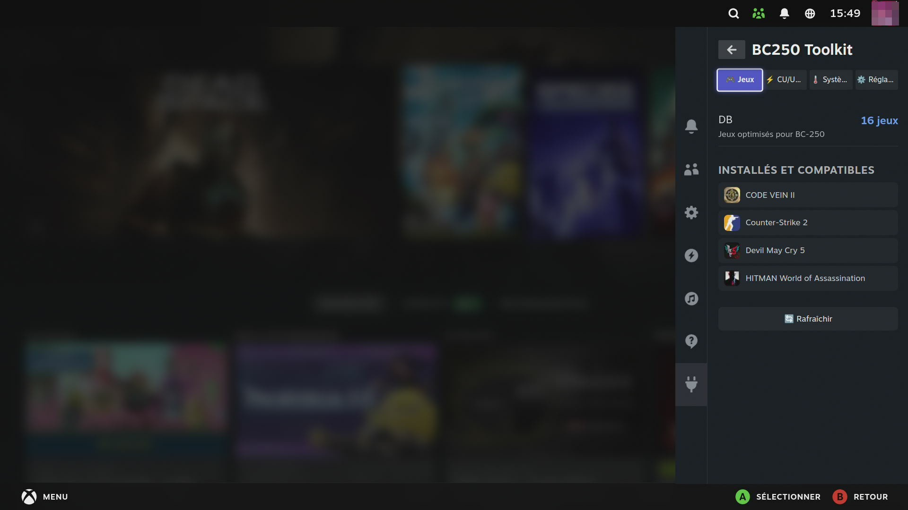
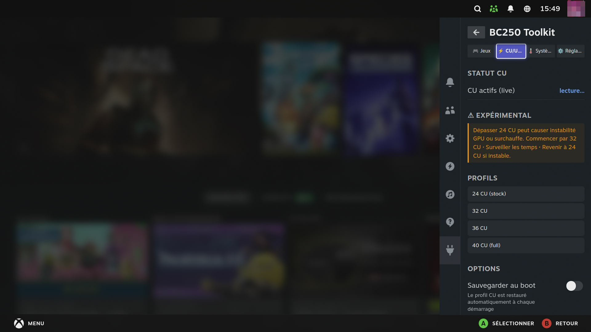
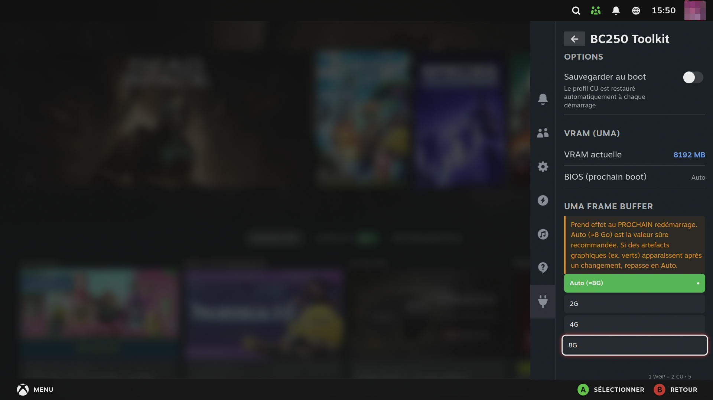
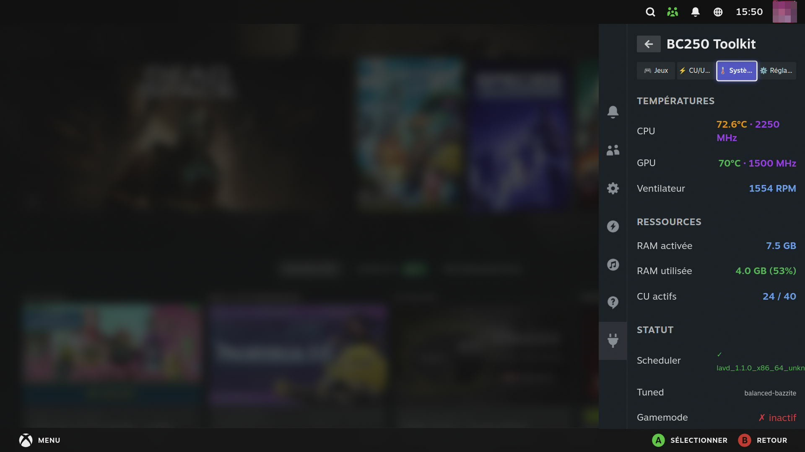

# BC250 Toolkit — DeckyLoader Plugin

> 🌐 [EN](README.md) · [FR](docs/README.fr.md) · [DE](docs/README.de.md) · [ES](docs/README.es.md) · [IT](docs/README.it.md) · [PT](docs/README.pt.md) · [NL](docs/README.nl.md) · [PL](docs/README.pl.md) · [RU](docs/README.ru.md)

A [DeckyLoader](https://github.com/SteamDeckHomebrew/decky-loader) plugin for the **ASRock BC-250** (AMD Ryzen Embedded V2000 / Cyan Skillfish) running Bazzite, SteamOS Linux, or CachyOS.

Community database of optimized launch options for the BC-250 — apply in one click from the Steam Quick Access Menu.

---

## Screenshots

<p align="center">
  
  
</p>
<p align="center">
  
  
</p>

---

## Features

### Games Tab
- Automatically detects the selected game in the Steam library
- Displays recommended settings for the BC-250 (Proton version, launch options, notes, hardware requirements)
- **Config variants** — when a game ships several tuned profiles (e.g. *Stable* vs *Performance*), pick one from a selector; your choice is remembered
- **Apply button** — in one action writes the launch options, selects the Proton/GE-Proton build, and applies any per-game GPU overrides (`~/.drirc` RADV options)
- **Auto-apply** (opt-in) — automatically applies the full config when a known game is launched; turning it on also pre-configures every installed game from the database

### CU/UMA Tab (Compute Units & VRAM)
- Live readout of active CU count via GPU SPI registers
- 4 profiles:
  - **24 CU** (stock BC-250)
  - **32 CU**
  - **36 CU**
  - **40 CU** (full — all WGPs active)
- Live application without reboot
- **Save to boot** toggle — installs a systemd service that restores the profile at each startup
- Requires `umr` — **automatic installation via a button** (`rpm-ostree` on Bazzite/SteamOS, `pacman` on CachyOS/Arch)
- Built-in disclaimer and stability recommendations
- **VRAM (UMA) management** — set the BIOS *UMA Frame Buffer Size* (**Auto / 2G / 4G / 8G**) right from the panel by patching the EFI NVRAM variable (`AmdSetup`) — no more digging through the BIOS screen. Takes effect at the **next reboot**; the panel shows both the live VRAM and the value staged in the BIOS
  - Guard rails: BIOS version whitelist (P3.00), NVRAM layout check, automatic backup before every write (buttons are disabled on unknown BIOSes)
  - Writing to the BIOS requires an up-to-date [bc250-tweaks](https://github.com/Necrosiak/bc250-tweaks) (provides the root helper `bc250-uma-helper` — no sudo password prompt)
  - **Auto (≈8 GB) is the recommended safe value** — if you get graphical artifacts (e.g. green glitches) after a change, switch back to Auto

### 8-core CPU unlock (6C/12T → 8C/16T)

The BC-250 enumerates only 6 of the 8 Zen 2 cores on its Oberon die. The panel
reads the core presence mask and, when the board is eligible, can wake the other
two up.

- **Status** — cores/threads currently online, plus the raw mask
- **Eligibility** — only a mask of exactly `0x77` is acted on. An asymmetric mask
  looks like genuine factory defect binning, and the SMU primitive writes `0xFF`
  regardless, so those boards are deliberately left alone
- **Unlock button** — takes effect at the **next reboot**
- The SMU governor is stopped for the write and restarted right after, whatever
  happens. Its unit name is auto-detected (`cyan-skillfish-governor-smu`,
  `oberon-governor`, …) so this works on any distribution — and it is fine if no
  governor is installed at all

> [!WARNING]
> **This is temporary by design.** The mask survives warm reboots, but a full
> power-off reverts it. Treat the button as a **compatibility test**: unlock,
> reboot, then stress-test for a few hours and check `dmesg` for machine-check
> errors before relying on those cores. They were disabled at the factory and
> nobody knows exactly why.

**Making it permanent** is a BIOS matter, not a software one. The community
firmware [AMD-BC-250-UEFI-v2.2-Firmware-Menu-Script](https://github.com/Forbidden-Darkness/AMD-BC-250-UEFI-v2.2-Firmware-Menu-Script)
(MIT) ships images suffixed `-T` that expose *Unlock CPU Cores* as a BIOS option
with an on/off toggle — permanent **and** reversible. They are published as the
`release-0.1.3.zip` asset, not in the repository's `Firmware/` folder. Flashing
firmware can brick the board, its `menu.nsh` backs your current firmware up
first, and **we ship no ROM ourselves** — verify what you flash by checksum.

Known side effect of the software unlock: `pp_dpm_sclk` and hwmon `freq1_input`
start reporting nonsense GPU clocks (tens of MHz instead of hundreds). The GPU
and the SMU are fine — only amdgpu's derived value is wrong, so the panel's GPU
clock readout becomes unreliable until the next cold boot.

Credit: the unlock primitive and the script are the work of
[rw-r-r-0644](https://github.com/rw-r-r-0644/bc250-core-unlock) (MIT, vendored
untouched in `core_unlock/upstream/` with its licence).

### System Tab
- Real-time CPU/GPU temperatures, fan speed and GPU/CPU clocks
- **CPU cores** — cores and threads currently online (`6C / 12T`, green at `8C / 16T`)
- **Resources** — enabled system RAM (what the OS keeps after the UMA carve-out), used RAM with usage percentage, and active CU count
- scx_lavd status, tuned profile, gamemode daemon status
- Manual update button for [bc250-tweaks](https://github.com/Necrosiak/bc250-tweaks)

### Settings Tab
- Auto-apply toggle
- DB refresh from GitHub
- About — plugin version, author and GitHub link

---

## Interface language

The plugin automatically detects the Steam interface language:

**English · Français · Deutsch · Español · Italiano · Português · Nederlands · Polski · Русский**

---

## Installation

### Via DeckyLoader (recommended)
1. Enable **Developer Mode** in Decky's general settings
2. Decky settings → **Developer** → *Install plugin from URL*:
   `https://github.com/Necrosiak/bc250-toolkit-decky/releases/latest/download/BC250-Toolkit.zip`

> Distributed directly from GitHub: the URL above always points to the latest release, and the plugin then keeps itself current with its built-in auto-update.

Manual installation:

```bash
git clone https://github.com/Necrosiak/bc250-toolkit-decky.git \
  ~/homebrew/plugins/BC250-Toolkit
sudo systemctl restart plugin_loader
```

### Requirements
- [DeckyLoader](https://github.com/SteamDeckHomebrew/decky-loader) installed
- Bazzite, SteamOS, or CachyOS on BC-250

---

## Games database

The DB is in [`games_db.json`](games_db.json) and updates automatically from GitHub.

### Supported games

| Game | Proton | Notes |
|---|---|---|
| Crimson Desert | Proton Experimental (bleeding-edge) | GPU spoof 731F required |
| Cyberpunk 2077 | GE-Proton | RT disabled recommended |
| Elden Ring | GE-Proton | ~60 FPS playable |
| Red Dead Redemption 2 | GE-Proton | Vulkan mode required |
| Control | GE-Proton | RT works (RDNA 1.5) |
| Counter-Strike 2 | Proton Experimental | 100+ FPS |
| Rocket League | Proton Experimental | 120+ FPS |
| Devil May Cry 5 | GE-Proton | ~100 FPS High |
| Company of Heroes 3 | GE-Proton | VRAM split 4 GB min required |
| Detroit: Become Human | Proton Experimental | Stable 60 FPS |
| The Last of Us Part I | GE-Proton | 60 FPS Medium-High |
| Black Myth: Wukong | GE-Proton | Unmodified game files required |
| Code Vein 2 | GE-Proton | UE5 DX12 — needs UMA Frame Buffer = Auto (~8G) + per-game unified-heap fix (auto-applied, see preset below) |
| Stardew Valley | Proton Experimental | Perfect |

### Known incompatible games
- **Fortnite** / **Valorant** — kernel-level EAC, Linux incompatible
- **FF VII Rebirth** — checks GPU ID, Cyan Skillfish not recognized, no fix available

---

## Contributing

🐛 **Bugs & ideas: please open issues!** Every report directly shapes the next
release. A few lines are enough — ideally with your OS (Bazzite, CachyOS…),
the plugin version, the QAM tab involved, and if possible the logs
(`~/homebrew/logs/BC250-Toolkit/`, `journalctl -u plugin_loader`). Feature
requests and "it works on X" reports are just as welcome.

The strength of this plugin is the BC-250 community.

### Easy way — Web form

Use the **[game submission form](https://necrosiak.github.io/bc250-toolkit-decky/)** — fill in the details, click Submit, and a GitHub issue is created automatically. Once approved, the game is added to the database via PR.

### Developer way — Direct PR

1. Fork this repo
2. Edit `games_db.json` following the existing format
3. Open a Pull Request

### Entry format

Minimal entry:

```json
"STEAM_APP_ID": {
  "name": "Game Name",
  "proton": "GE-Proton10-34",
  "launch_options": "MANGOHUD=1 MANGOHUD_CONFIG=no_display gamemoderun %command%",
  "notes": "BC-250 specific notes",
  "tested_on": "BC-250"
}
```

Optional advanced fields (the plugin applies them automatically on **Apply**):

- **`compat_tool`** — Proton/GE-Proton build to select via Steam's compatibility mapping
- **`radv`** — per-game Mesa RADV overrides written to `~/.drirc`, matched on the executable name, e.g. `{"match": "Game-Win64-Shipping.exe", "options": {"radv_enable_unified_heap_on_apu": false}}`
- **`requires`** — hardware prerequisites surfaced to the user (`uma_min_mb`, `gttsize`)
- **`configs`** — array of alternative variants, each with its own `label`, `stability`, `compat_tool`, `launch_options`, `radv`, `requires`; the user picks one in the Games tab

> The Steam AppID is found in the URL of the game's Steam Store page.

### Reusable preset — UE5 DX12 "out of video memory"

Some Unreal Engine 5 games in DX12 crash at render init (`D3D12Util.cpp:926 — Out of video memory`) **even with plenty of VRAM free**, because RADV's unified heap on APU hides the dedicated VRAM from VKD3D (`DedicatedVideoMemory ≈ 0`). `games_db.json` ships a reusable **`ue5_dx12_oom`** profile under `_meta.presets`: disable the unified heap for that game's executable + set the BIOS **UMA Frame Buffer** to **Auto** (already yields ~8 GB on a 16 GB BC-250 — no need to force 4G) + use GE-Proton for the video codecs. To fix a new affected game, copy the preset into its entry and set `radv.match` to its executable. First validated on **Code Vein 2**.

---

## Build (developers)

```bash
pnpm install
pnpm run build

# Deploy locally
sudo cp dist/index.js ~/homebrew/plugins/BC250-Toolkit/dist/
sudo cp main.py updater.py bios_uma.py games_db.json package.json ~/homebrew/plugins/BC250-Toolkit/
sudo systemctl restart plugin_loader
```

---

## See also

- [bc250-tweaks](https://github.com/Necrosiak/bc250-tweaks) — full system tweaks + auto-update
- [AMD BC-250 Docs](https://elektricm.github.io/amd-bc250-docs) — community wiki
- [bc250.info](https://bc250.info)

---

## Community contributors

- [@AyeZeeBB](https://github.com/AyeZeeBB) — CachyOS/Arch support for the umr installation + GPU instance fallback (merged from their fork)
- [@rw-r-r-0644](https://github.com/rw-r-r-0644) — found the 8-core unlock: the core presence mask at SMN `0x0115A870` and the ungated SMU queue-3 message that can write it, plus the decision to act only on a `0x77` mask. Their script is vendored untouched in `core_unlock/upstream/` (MIT) and does all the writing
- [@Forbidden-Darkness](https://github.com/Forbidden-Darkness) — the modified P3.00 firmware that exposes the 8-core unlock as a BIOS option with an on/off toggle, and the flashing menu that backs your current firmware up first ([AMD-BC-250-UEFI-v2.2-Firmware-Menu-Script](https://github.com/Forbidden-Darkness/AMD-BC-250-UEFI-v2.2-Firmware-Menu-Script), MIT)
- [Old Lamer](https://www.youtube.com/@OldLamer) — the videos that documented both unlock routes end to end and brought them to a wider audience

---

## 🐧 Compatibility

We actively work to make this plugin run on **every operating system documented for the BC-250** ([community docs](https://elektricm.github.io/amd-bc250-docs)) — Bazzite, SteamOS, CachyOS/Arch, Fedora… — with **automatic OS detection** (package manager, GPU instance) so the right method is used on your distro.
