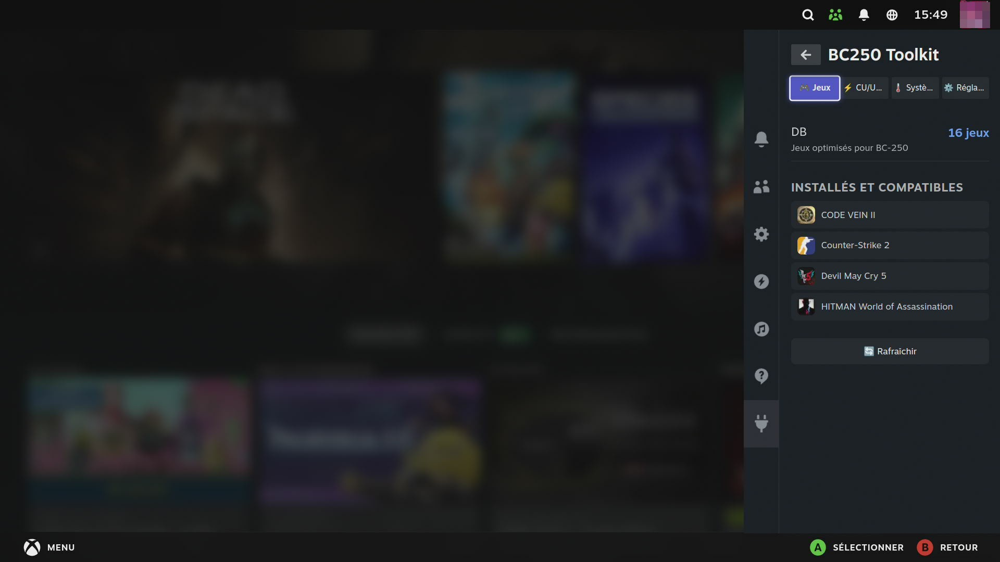
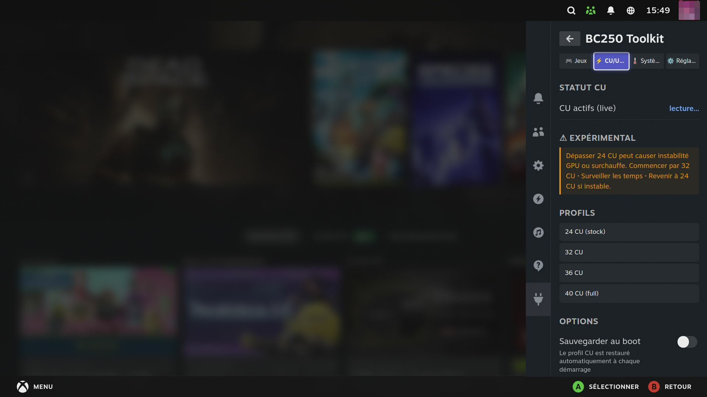
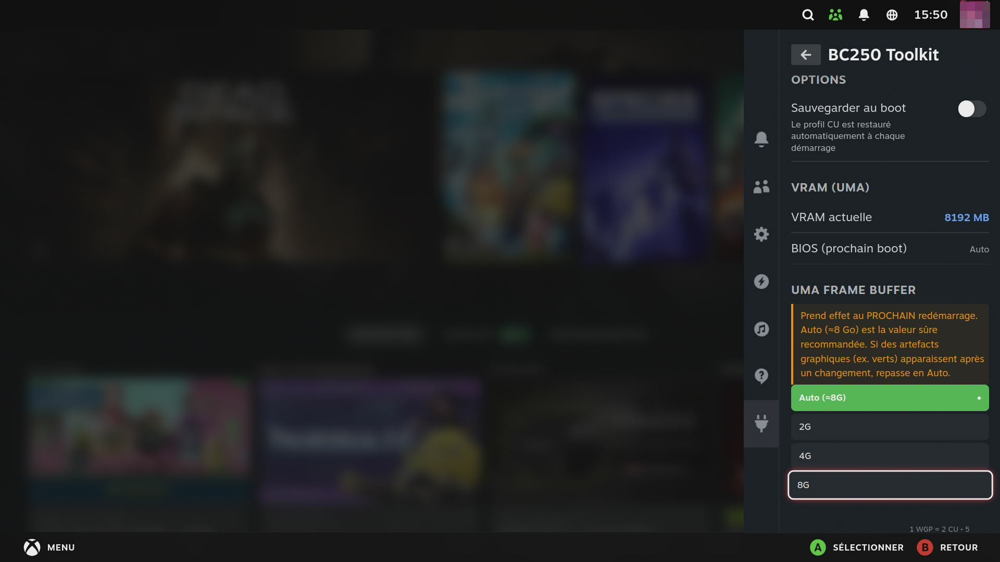
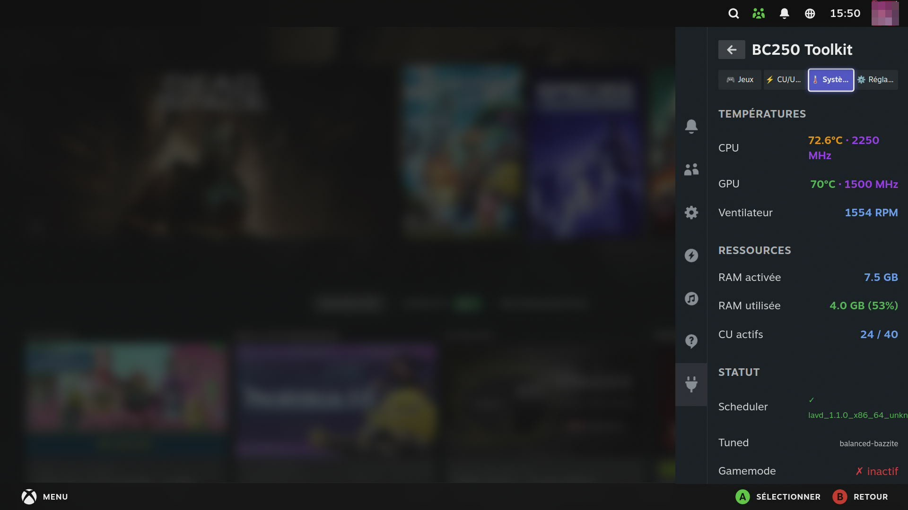

# BC250 Toolkit — DeckyLoader Plugin

> 🌐 [EN](../README.md) · [FR](README.fr.md) · [DE](README.de.md) · [ES](README.es.md) · [IT](README.it.md) · [PT](README.pt.md) · [NL](README.nl.md) · [PL](README.pl.md) · [RU](README.ru.md)

Ein [DeckyLoader](https://github.com/SteamDeckHomebrew/decky-loader)-Plugin für den **ASRock BC-250** (AMD Ryzen Embedded V2000 / Cyan Skillfish) unter Bazzite, SteamOS Linux oder CachyOS.

Community-Datenbank mit optimierten Startoptionen für den BC-250 — direkt aus dem Steam Quick Access Menu anwendbar.

---

## 📸 Screenshots

<p align="center">
  
  
</p>
<p align="center">
  
  
</p>

## Funktionen

### Spiele-Tab
- Erkennt automatisch das ausgewählte Spiel in der Steam-Bibliothek
- Zeigt empfohlene Einstellungen für den BC-250 (Proton-Version, Startoptionen, Hinweise, Hardware-Voraussetzungen)
- **Konfigurationsvarianten** — wenn ein Spiel mehrere optimierte Profile bietet (z. B. *Stable* vs *Performance*), wählt man eines über einen Selektor; die Auswahl wird gespeichert
- **Übernehmen-Schaltfläche** — schreibt in einer Aktion die Startoptionen, wählt den Proton/GE-Proton-Build und wendet etwaige spielbezogene GPU-Overrides an (RADV-Optionen in `~/.drirc`)
- **Auto-Apply** (opt-in) — wendet die vollständige Konfiguration automatisch an, wenn ein bekanntes Spiel gestartet wird; beim Aktivieren werden zudem alle installierten Spiele aus der Datenbank vorkonfiguriert

### CU/UMA-Tab (Compute Units & VRAM)
- Live-Anzeige der aktiven CU-Anzahl über GPU-SPI-Register
- 4 Profile:
  - **24 CU** (BC-250 Standard)
  - **32 CU**
  - **36 CU**
  - **40 CU** (voll — alle WGPs aktiv)
- Live-Anwendung ohne Neustart
- **Beim Start speichern**-Schalter — installiert einen systemd-Dienst, der das Profil bei jedem Start wiederherstellt
- Benötigt `umr` — **automatische Installation per Schaltfläche** (`rpm-ostree` unter Bazzite/SteamOS, `pacman` unter CachyOS/Arch)
- Integrierter Hinweis und Stabilitätsempfehlungen
- **VRAM-Verwaltung (UMA)** — stellt die *UMA Frame Buffer Size* des BIOS (**Auto / 2G / 4G / 8G**) direkt aus dem Panel ein, indem die EFI-NVRAM-Variable (`AmdSetup`) gepatcht wird — kein Umweg mehr über den BIOS-Bildschirm. Wirkt beim **nächsten Neustart**; das Panel zeigt die aktuelle VRAM und den im BIOS vorgemerkten Wert
  - Schutzmechanismen: BIOS-Versions-Whitelist (P3.00), NVRAM-Layout-Prüfung, automatisches Backup vor jedem Schreiben (Buttons bei unbekanntem BIOS deaktiviert)
  - Das Schreiben ins BIOS erfordert ein aktuelles [bc250-tweaks](https://github.com/Necrosiak/bc250-tweaks) (liefert den Root-Helper `bc250-uma-helper` — keine sudo-Passwortabfrage)
  - **Auto (≈8 GB) ist der empfohlene sichere Wert** — bei Grafikartefakten (z. B. grünen Störungen) nach einer Änderung zurück auf Auto stellen

### System-Tab
- CPU/GPU-Temperaturen in Echtzeit, Lüfterdrehzahl und GPU/CPU-Takt
- **Ressourcen** — aktivierter System-RAM (was dem OS nach dem UMA-Carve-out bleibt), belegter RAM mit Prozentanzeige und Anzahl aktiver CUs
- scx_lavd-Status, Tuned-Profil, Gamemode-Daemon-Status
- Manuelle Aktualisierungsschaltfläche für [bc250-tweaks](https://github.com/Necrosiak/bc250-tweaks)

### Einstellungen-Tab
- Auto-Apply-Schalter
- DB-Aktualisierung von GitHub
- Über — Plugin-Version, Autor und GitHub-Link

---

## Sprache

Das Plugin erkennt automatisch die Steam-Sprache:

**English · Français · Deutsch · Español · Italiano · Português · Nederlands · Polski · Русский**

---

## Installation

### Über DeckyLoader (empfohlen)
1. **Entwicklermodus** in Deckys allgemeinen Einstellungen aktivieren
2. Decky-Einstellungen → **Entwickler** → *Plugin von URL installieren*:
   `https://github.com/Necrosiak/bc250-toolkit-decky/releases/latest/download/BC250-Toolkit.zip`

> Direkter Vertrieb über GitHub: die URL oben zeigt immer auf das neueste Release, danach hält sich das Plugin per eingebautem Auto-Update selbst aktuell.

Manuelle Installation in der Zwischenzeit:

```bash
git clone https://github.com/Necrosiak/bc250-toolkit-decky.git \
  ~/homebrew/plugins/BC250-Toolkit
sudo systemctl restart plugin_loader
```

### Voraussetzungen
- [DeckyLoader](https://github.com/SteamDeckHomebrew/decky-loader) installiert
- Bazzite, SteamOS oder CachyOS auf BC-250

---

## Spieldatenbank

Die DB befindet sich in [`games_db.json`](../games_db.json) und aktualisiert sich automatisch von GitHub.

### Unterstützte Spiele

| Spiel | Proton | Hinweise |
|---|---|---|
| Crimson Desert | Proton Experimental (bleeding-edge) | GPU-Spoof 731F erforderlich |
| Cyberpunk 2077 | GE-Proton | RT deaktiviert empfohlen |
| Elden Ring | GE-Proton | ~60 FPS spielbar |
| Red Dead Redemption 2 | GE-Proton | Vulkan-Modus erforderlich |
| Control | GE-Proton | RT funktioniert (RDNA 1.5) |
| Counter-Strike 2 | Proton Experimental | 100+ FPS |
| Rocket League | Proton Experimental | 120+ FPS |
| Devil May Cry 5 | GE-Proton | ~100 FPS Hoch |
| Company of Heroes 3 | GE-Proton | VRAM-Split mind. 4 GB erforderlich |
| Detroit: Become Human | Proton Experimental | Stabile 60 FPS |
| The Last of Us Part I | GE-Proton | 60 FPS Medium-Hoch |
| Black Myth: Wukong | GE-Proton | Unveränderte Spieldateien erforderlich |
| Code Vein 2 | GE-Proton | UE5 DX12 — benötigt UMA Frame Buffer = Auto (~8G) + spielbezogenen Unified-Heap-Fix (automatisch, siehe Preset unten) |
| Stardew Valley | Proton Experimental | Perfekt |

### Bekannte inkompatible Spiele
- **Fortnite** / **Valorant** — Kernel-EAC, Linux inkompatibel
- **FF VII Rebirth** — Prüft GPU-ID, Cyan Skillfish nicht erkannt, kein Fix verfügbar

---

## Beitragen

🐛 **Bugs & Ideen: eröffnet Issues!** Jede Meldung bestimmt direkt die nächste
Release mit. Ein paar Zeilen genügen — idealerweise mit eurem OS (Bazzite,
CachyOS…), der Plugin-Version, dem betroffenen QAM-Tab und wenn möglich den
Logs (`~/homebrew/logs/BC250-Toolkit/`, `journalctl -u plugin_loader`).
Feature-Wünsche und „läuft auf X“-Meldungen sind genauso willkommen.

### Einfache Methode — Webformular

Nutze das **[Einreichungsformular](https://necrosiak.github.io/bc250-toolkit-decky/)** — fülle die Angaben aus, klicke auf Einreichen, und ein GitHub-Issue wird automatisch erstellt. Nach Genehmigung wird das Spiel per PR hinzugefügt.

### Entwickler-Methode — Direkter PR

1. Forke dieses Repository
2. Bearbeite `games_db.json` entsprechend dem vorhandenen Format
3. Öffne einen Pull Request

### Eintragsformat

```json
"STEAM_APP_ID": {
  "name": "Spielname",
  "proton": "GE-Proton10-34",
  "launch_options": "MANGOHUD=1 MANGOHUD_CONFIG=no_display gamemoderun %command%",
  "notes": "BC-250-spezifische Hinweise",
  "tested_on": "BC-250"
}
```

Optionale erweiterte Felder (das Plugin wendet sie beim Klick auf **Übernehmen** automatisch an):

- **`compat_tool`** — Proton/GE-Proton-Build, der über das Steam-Kompatibilitäts-Mapping ausgewählt wird
- **`radv`** — spielbezogene Mesa-RADV-Overrides, die in `~/.drirc` geschrieben werden, Match über den Namen der ausführbaren Datei, z. B. `{"match": "Game-Win64-Shipping.exe", "options": {"radv_enable_unified_heap_on_apu": false}}`
- **`requires`** — Hardware-Voraussetzungen, die dem Benutzer angezeigt werden (`uma_min_mb`, `gttsize`)
- **`configs`** — Array alternativer Varianten, jede mit eigenem `label`, `stability`, `compat_tool`, `launch_options`, `radv`, `requires`; der Benutzer wählt eine im Spiele-Tab

> Die Steam-AppID befindet sich in der URL der Spielseite im Steam Store.

### Wiederverwendbares Preset — UE5 DX12 „out of video memory"

Manche Unreal-Engine-5-Spiele in DX12 stürzen bei der Render-Initialisierung ab (`D3D12Util.cpp:926 — Out of video memory`), **obwohl reichlich VRAM frei ist**, weil der Unified Heap von RADV auf APU den dedizierten VRAM vor VKD3D verbirgt (`DedicatedVideoMemory ≈ 0`). `games_db.json` enthält ein wiederverwendbares **`ue5_dx12_oom`**-Profil unter `_meta.presets`: Unified Heap für die ausführbare Datei deaktivieren + BIOS-**UMA Frame Buffer** auf **Auto** setzen (liefert auf einem 16-GB-BC-250 bereits ~8 GB — 4G muss nicht erzwungen werden) + GE-Proton für die Video-Codecs. Um ein neues betroffenes Spiel zu fixen, das Preset in dessen Eintrag kopieren und `radv.match` auf dessen ausführbare Datei setzen. Zuerst auf **Code Vein 2** validiert.

---

## Build (Entwickler)

```bash
pnpm install
pnpm run build

# Lokal bereitstellen
sudo cp dist/index.js ~/homebrew/plugins/BC250-Toolkit/dist/
sudo cp main.py updater.py bios_uma.py games_db.json package.json ~/homebrew/plugins/BC250-Toolkit/
sudo systemctl restart plugin_loader
```

---

## Siehe auch

- [bc250-tweaks](https://github.com/Necrosiak/bc250-tweaks) — vollständige System-Tweaks + Auto-Update
- [AMD BC-250 Docs](https://elektricm.github.io/amd-bc250-docs) — Community-Wiki
- [bc250.info](https://bc250.info)

---

## Community-Mitwirkende

- [@AyeZeeBB](https://github.com/AyeZeeBB) — CachyOS/Arch-Unterstützung für die umr-Installation + GPU-Instanz-Fallback (aus seinem Fork übernommen)

---

## 🐧 Kompatibilität

Wir arbeiten aktiv daran, dass dieses Plugin auf **jedem für den BC-250 dokumentierten Betriebssystem** ([Community-Doku](https://elektricm.github.io/amd-bc250-docs)) läuft — Bazzite, SteamOS, CachyOS/Arch, Fedora… — mit **automatischer OS-Erkennung** (Paketmanager, GPU-Instanz), damit auf deiner Distribution die richtige Methode verwendet wird.
